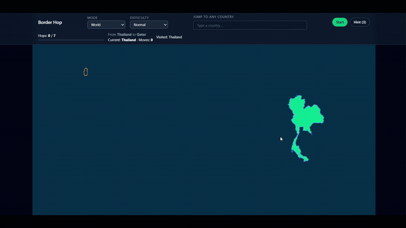

# Border Hop
*A geography-puzzle game built with React, TypeScript, D3, and modern web tooling.*

[Play the live demo](https://border-hop-amber.vercel.app/)

Border Hop is an interactive world-map puzzle game where players must navigate from a **start country** to a **target country** using only valid **land borders** ("hops"). The game features multiple modes including **World**, **Europe**, and **Practice**, each offering its own challenge. It also incorporates hints, difficulty settings, animated toasts, real-time path visualisation, and a clean, dark, responsive UI.

## Gameplay

Each move must select a country that shares a border with the current country.

The challenge comes from:

- limited hop counts based on difficulty
- hidden maps in certain modes
- discovering efficient geographic routes

## Demo


> _Example gameplay: Start in one country and hop your way to the target._

## **Features**

### Interactive Geography Gameplay  
- Select neighbouring countries to travel from **source -> destination**.  
- Map interaction powered by **D3 (d3-geo + d3-zoom)**.  
- Smooth zoom/pan with automatic "fit to route" framing of start & destination.

### Game Modes  
- **World** - Standard rules, all countries.
- **Europe** - Standard rules, EU countries only. 
- **Practice** - All countries visible, experiment with routes.  

### Difficulty System  
- Four presets: Easy, Normal, Hard, Extreme.  
- Difficulty determines minimum/maximum hops for generated routes.  

### Smart Hints  
- In normal modes: reveal the outline of the next optimal hop based on BFS shortest path.  
- In Practice mode: highlight the next unvisited country along the shortest path.

### Polished UI / UX  
- Dark, modern theme with **Tailwind** component classes.
- Responsive HUD and map layout.  
- Toasts for duplicate guesses, failed route generation, and other events.  
- End-of-game overlay shows:  
  - Total hops taken  
  - Optimal path length  
  - Full list of countries along the shortest route

### Accurate Geodata  
- Uses **GeoJSON files** for world and Europe maps (https://geojson-maps.kyd.au/).  
- Preprocessing scripts:  
  - `make-neighbours.mjs` extracts border adjacency using TopoJSON.  
  - `simplify-geo.mjs` reduces polygon complexity for faster rendering.

## **Tech Stack**

| Category | Tools |
|------|-------------|
| Framework | [React](https://react.dev/) + [Vite](https://vitejs.dev/) |
| Language | [TypeScript](https://www.typescriptlang.org/) |
| Styling | [Tailwind CSS](https://tailwindcss.com/) |
| State Management | [Zustand](https://github.com/pmndrs/zustand) |
| Maps | [D3 Geo](https://github.com/d3/d3-geo) + [TopoJSON](https://github.com/topojson/topojson-client) |
| Deployment | [Docker](https://www.docker.com/) + [Vercel](https://border-hop-amber.vercel.app/) |

## **Project Structure**

```
src/
  ui/
    HUD.tsx
    Map.tsx
    CountryPath.tsx
    CountrySearch.tsx
  game/
    graph.ts
    modes.ts
    difficulty.ts
    reachability.ts
  store/
    game.ts

public/
  countries.cleaned.geojson
  countries.cleaned.simplified.geojson

scripts/
  prepare-countries.mjs
  simplify-geo.mjs
  build-neighbours.mjs

Dockerfile
README.md
```

## Local Setup

```bash
# 1. Clone & install
git clone https://github.com/donnchadh00/border-hop.git
cd border-hop
npm install

# 2. Run development server
npm run dev

# 3. Build for production
npm run build
```

## **Docker**
Fully containerized build for easy deployment:

### Build image and run container
```bash
docker build -t border-hop .
docker run -p 5173:80 border-hop
```
alternatively use docker compose file
```bash
docker compose up --build -d
```

## **Technical Overview**

### Route Generation
- Random start + end taken from the selected mode’s country pool.  
- BFS shortest path between them is computed.  
- Hops must fall within the selected difficulty's min/max hop window.  
- Smart backoff: retries route selection with varying hop budgets.

### Game Loop
1. Player selects countries via search bar.  
2. Moves increment, visited set updates.  
3. Win if reached target within allowed moves.  
4. Lose if out of hops without a winning path.

### Rendering Pipeline
- GeoJSON -> TopoJSON -> SVG paths via `d3-geo`.  
- Projection: Mercator fitted dynamically to map bounds.  
- Smooth panning/zooming via `d3-zoom`.
